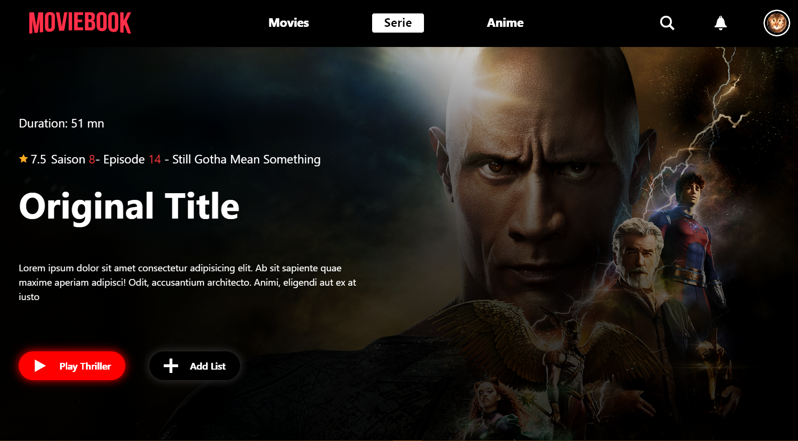

# Streaming App

 

## Description

Une application web de streaming gratuite inspirée de Netflix, permettant aux utilisateurs de personnaliser leurs recommandations, de télécharger gratuitement des films et des séries, de les visionner, de les enregistrer, de les noter, de commenter, et de suivre d'autres utilisateurs. L'application est construite avec Django REST Framework pour le backend et ReactJS pour le frontend, en utilisant l'API OMDB pour obtenir des informations sur les films.

## Fonctionnalités

- **Personnalisation des Recommandations** : Suggestions basées sur les préférences et l'historique de visionnage.
- **Téléchargement Gratuit** : Téléchargez des films et des séries pour un visionnage hors ligne.
- **Visionnage en Streaming** : Accès instantané à un large catalogue de films et de séries.
- **Enregistrement et Sauvegarde** : Enregistrez vos films et séries préférés dans une bibliothèque personnelle.
- **Évaluation et Commentaires** : Notez et commentez les films et les séries.
- **Suivi des Utilisateurs** : Suivez d'autres utilisateurs et découvrez leurs recommandations et playlists.
- **Vente de Recommandations et Playlists** : Monétisez via la vente de recommandations et de playlists.

## Technologies

- **Backend** : Django REST Framework
- **Frontend** : ReactJS
- **API** : OMDB API

## Installation

### Backend

1. Clonez le dépôt :

    ```bash
    git clone https://github.com/username/repository.git
    cd repository/backend
    ```

2. Créez un environnement virtuel et activez-le :

    ```bash
    python -m venv venv
    source venv/bin/activate  # Sur Windows : venv\Scripts\activate
    ```

3. Installez les dépendances :

    ```bash
    pip install -r requirements.txt
    ```

4. Configurez les variables d'environnement (voir `.env.example` pour un modèle) :

    ```bash
    cp .env.example .env
    ```

5. Appliquez les migrations et démarrez le serveur :

    ```bash
    python manage.py migrate
    python manage.py runserver
    ```

### Frontend

1. Accédez au répertoire du frontend :

    ```bash
    cd ../app
    ```

2. Installez les dépendances :

    ```bash
    npm install
    ```

3. Démarrez l'application React :

    ```bash
    npm start
    ```

## Configuration de l'API OMDB

1. Obtenez une clé API depuis [OMDB API](http://www.omdbapi.com/apikey.aspx).
2. Ajoutez votre clé API dans le fichier de configuration backend (`.env`).

## Contribuer

Les contributions sont les bienvenues ! Pour suggérer des améliorations ou signaler des problèmes, veuillez ouvrir une issue ou une pull request.

## Licence

Ce projet est sous la licence [MIT](LICENSE).

## Contact

Pour toute question, vous pouvez me contacter à [kwadjoaoukou@example.com](mailto:kwadjoaoukou@example.com).
